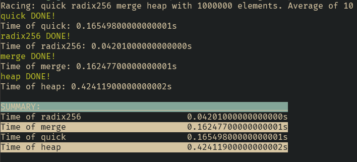

# Sorting

---------
A collection of sorting algorithms inplemented in the C programming language.

## Installation
With make, simply run
```shell
make all
```

## Racing the algorithms
An example of racing quick, radix, merge and heap sort with 1.000.000 integers
and averaging the times over 10 runs.
```shell
./race quick radix256 merge heap -n 1000000 -r 10
```


## Implemented Algorithms
- Bubble Sort
- Insertion Sort
- Merge Sort
- Merge Sort (3 splits)
- Heap Sort
- Cocktail Sort
- Quick Sort
- Radix Sort (base 256)
